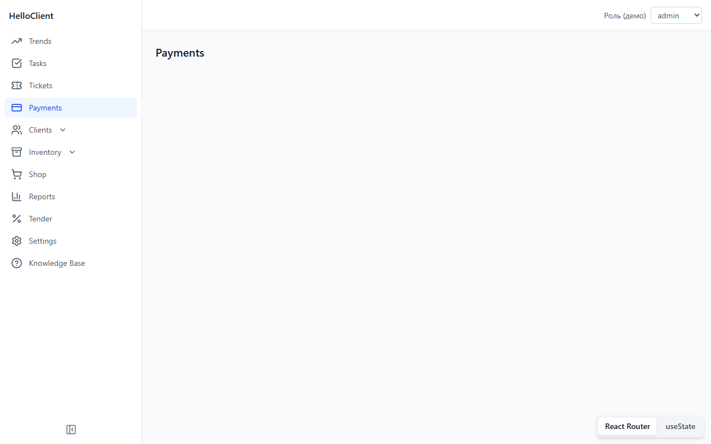
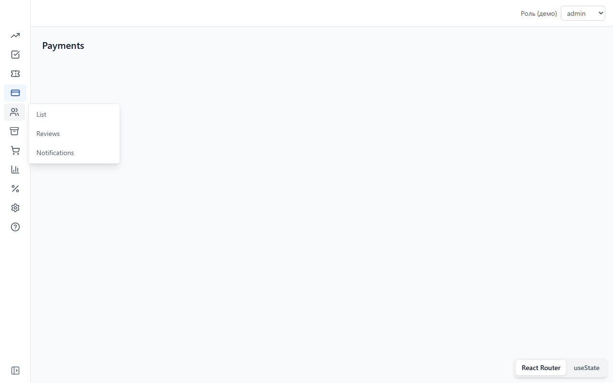
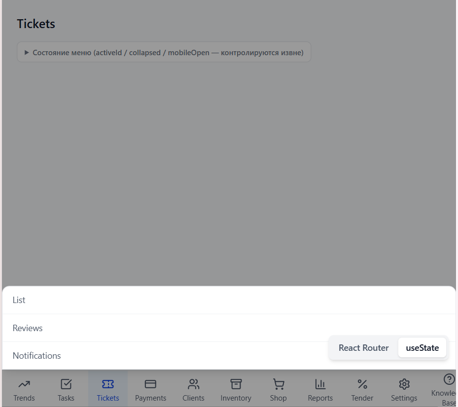
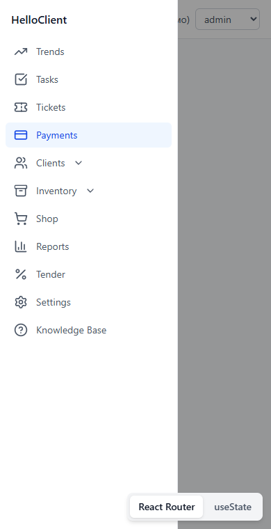
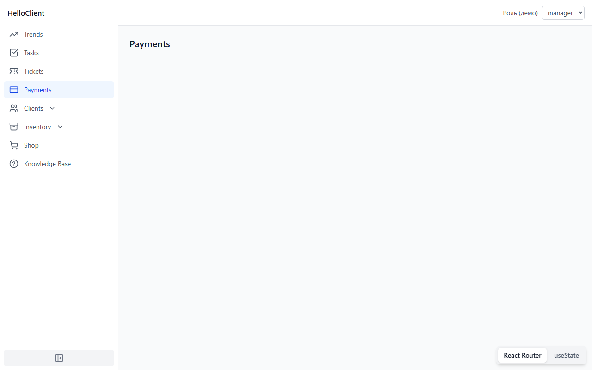

# Client Menu

Headless (без стилей) компонент бокового меню на React + TypeScript. Сам
компонент отвечает только за логику — какой пункт активен, как раскрывается
подменю, узкий/широкий режим, адаптация под мобильные и планшетные экраны,
доступность. Вся разметка и стили — на стороне приложения, которое его
использует. В демо показана интеграция и с `react-router-dom`, и с обычным
`useState`, включая фильтрацию пунктов меню по роли пользователя.

## Демо

🔗 https://sergey-draft.github.io/client-menu/

## Стек

- React 19, TypeScript, Vite
- Tailwind CSS 4
- react-router-dom — используется только в демо-приложении, не внутри самого меню
- Vitest + Testing Library
- ESLint (+ `eslint-plugin-jsx-a11y`), Prettier
- GitHub Actions — CI и деплой на GitHub Pages

## Структура репозитория

```
src/sidebar-menu/   сам компонент меню: состояние, логика, доступность (без стилей)
src/demo/           пример использования на Tailwind: две демо-страницы
```

## Запуск

Требуется Node.js 20+.

```bash
npm install
npm run dev      # http://localhost:5173
npm run test
npm run lint
npm run build
```

## API

Компонентный подход (не JSON-конфиг): дерево меню собирается через JSX.
`Menu.Root` можно как контролировать снаружи, так и оставить
неконтролируемым — этим и обеспечивается лёгкая интеграция с роутером или с
`useState`.

| Компонент                                | Назначение                                                                                             |
| ----------------------------------------- | -------------------------------------------------------------------------------------------------------- |
| `Menu.Root`                               | провайдер состояния: `activeId`, `collapsed`, `mobileOpen`                                              |
| `Menu.List`                               | `<ul>`-обёртка списка пунктов                                                                            |
| `Menu.Item`                               | пункт меню; кликабельный элемент передаётся через render-prop — `<button>`, `<a>` или `<Link>` роутера |
| `Menu.Group`                              | пункт с вложенным подменю — как он открывается, решает потребитель через CSS-брейкпоинты (см. «Адаптивность») |
| `Menu.CollapseTrigger`                    | переключатель узкий/широкий режим                                                                       |
| `Menu.MobileTrigger` / `Menu.MobileOverlay` | кнопка и backdrop мобильного drawer                                                                     |

```tsx
<Menu.Root activeId={activeId} collapsed={collapsed} onCollapsedChange={setCollapsed}>
  <Menu.List>
    <Menu.Item id="/payments" onSelect={() => setActiveId("/payments")}>
      {({ isActive, itemProps }) => (
        <button {...itemProps} className={isActive ? "text-blue-700" : "text-gray-600"}>
          Payments
        </button>
      )}
    </Menu.Item>
  </Menu.List>
</Menu.Root>
```

## Адаптивность

Три режима, переключаются по ширине экрана (границы совпадают с брейкпоинтами Tailwind):

| Ширина             | Режим                                                                                    |
| -------------------- | ------------------------------------------------------------------------------------------ |
| `< 640px`             | Мобильный off-canvas drawer, открывается кнопкой-гамбургером                              |
| `640px – 1023px`      | Нижняя панель вкладок (планшеты, большие телефоны); подменю открывается как bottom sheet поверх контента, закрывается тапом вне области |
| `≥ 1024px`            | Боковой rail: узкий (иконки) или широкий (иконки + подписи), переключается кнопкой внизу   |

Headless-ядро знает только один флаг — `isMobile` (`< 640px`). Он решает, как
себя ведёт подменю у `Menu.Group` (accordion или flyout) и когда закрывать
мобильный drawer при ресайзе окна. Вся остальная адаптивность, включая нижнюю
панель и bottom sheet, — это Tailwind-классы в `src/demo/Sidebar.tsx` и
`RouterSidebar.tsx`; сам компонент про них не знает.

## Возможности

- четыре адаптивных вида (drawer / нижняя панель / узкий rail / широкий rail), controlled или uncontrolled
- подменю: accordion (широкий режим, нижняя панель, мобильный drawer), flyout по hover/клику (узкий rail), bottom sheet (нижняя панель)
- мобильный drawer с backdrop, автозакрытие при выборе пункта
- доступность: `aria-current`, `aria-expanded`, `aria-controls`, скрытые подписи (`sr-only`) в узком режиме, закрытие flyout по Escape и по потере фокуса
- две демо-интеграции: `react-router-dom` (`HashRouter`, реальные `<Link>`) и `useState`
- фильтрация пунктов и самих маршрутов по роли пользователя — переключатель роли прямо в демо
- на демо-страницах есть свёрнутая по умолчанию панель с живым JSON текущего состояния меню (`activeId` / `collapsed` / `mobileOpen`) — чтобы не лезть в devtools, если нужно проверить, что состояние реально контролируется снаружи

## CI/CD

- `.github/workflows/ci.yml` — lint, typecheck, тесты и сборка на каждый PR
- `.github/workflows/deploy.yml` — сборка и деплой на GitHub Pages при пуше в `main`

## Скриншоты

| Широкий режим (desktop)                     | Узкий режим (flyout)                                          |
| ---------------------------------------------- | ----------------------------------------------------------------- |
|     |       |

| Нижняя панель + bottom sheet (планшет)         | Мобильный drawer                                               |
| ---------------------------------------------- | ----------------------------------------------------------------- |
|  |                   |


